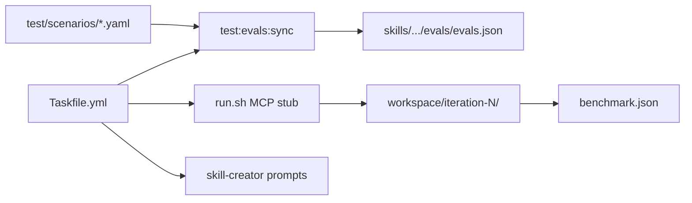

# Align testing with Claude skill-creator best practices

Imperative plan to align hc-scaffold-service testing with Anthropic skill-creator / [agentskills.io evaluating-skills](https://agentskills.io/skill-creation/evaluating-skills) practices, while keeping the MCP stub harness. Same voice as [implementation-plan.md](implementation-plan.md): decisions are settled.

Related: [skill-vs-baseline.md](skill-vs-baseline.md), [testing.md](testing.md), [maintaining.md](maintaining.md), [CLAUDE.md](../CLAUDE.md), [README.md](../README.md).

Sources: [Agent Skills overview](https://platform.claude.com/docs/en/agents-and-tools/agent-skills/overview), [Claude Code skills / skill-creator](https://code.claude.com/docs/en/skills#run-evals-with-skill-creator), [Evaluating skill output quality](https://agentskills.io/skill-creation/evaluating-skills).

## 1. Decisions (settled)

### Hybrid runner

| Layer | Role |
|-------|------|
| **Primary** | MCP stub [`test/run.sh`](../test/run.sh) — fail-fast, schema, tool-call assertions |
| **Compatibility** | skill-creator / agentskills formats — `skills/hc-scaffold-service/evals/evals.json`, iteration workspace, `grading.json` / `timing.json` / `benchmark.json` |
| **Secondary** | skill-creator plugin — description/trigger tuning, optional improve / blind version A/B |

Do **not** make skill-creator the primary runner: it cannot drive `STUB_SCENARIO` / fixture MCP without wrapping today’s harness.

### Taskfile is the only operator entrypoint

Root [`Taskfile.yml`](../Taskfile.yml) ([go-task](https://taskfile.dev/), `version: '3'`). Humans and agents run **`task …` only**. `run.sh` and Python helpers are implementation details behind tasks.

Docs (CLAUDE, README, skill-vs-baseline, testing, maintaining) **MUST** cite `task <name>`, not long `run.sh` flag strings.

## 2. Required Taskfile tasks

| Task | What it does |
|------|----------------|
| `test:guards` | Genericity grep + SKILL.md line budget |
| `test:evals:sync` | Emit/update `skills/hc-scaffold-service/evals/evals.json` from `test/scenarios/*.yaml` |
| `test:evals:check` | Drift-only check (CI): scenarios ↔ evals.json in sync |
| `test:list` | List compare scenarios / labels |
| `test:scenario` | Run scenario(s) with skill (`TESTS=` / CLI args) |
| `test:scenario:no-skill` | Same without skill |
| `test:compare` | Full A/B → workspace iteration + `benchmark.json` |
| `test:compare:tier1` | Cheap fail-fast A/B |
| `test:compare:tier` | A/B with `TIER=1,2` |
| `test:compare:type` | A/B with `TYPE=preflight` |
| `test:compare:feature` | A/B with `FEATURE=fail-fast` |
| `test:compare:tests` | A/B with `TESTS=name1,name2` |
| `test:diff` | Diff two benchmark/report paths (`A=` `B=`) |
| `test:skill-creator:install` | Install hint for `skill-creator@claude-plugins-official` |
| `test:skill-creator:eval` | Print Claude Code prompt to evaluate this skill (plugin is interactive) |
| `test:skill-creator:triggers` | Print prompt for description/trigger tuning |
| `test` | Default gate: `test:guards` then `test:compare:tier1` |

```bash
task test:compare:tier1
task test:compare:tier TIER=1,2
task test:compare:tests TESTS=preflight-empty-catalog,time-pressure
task test:compare TIER=2 TYPE=discipline
task test:scenario TESTS=plain-request MODEL=claude-sonnet-4-5
task test:diff A=test/workspace/iteration-1/benchmark.json B=test/workspace/iteration-2/benchmark.json
```

**Prerequisite:** [install Task](https://taskfile.dev/installation/) (`brew install go-task` or equivalent). Fail clearly if `task` or `docker` is missing.

**skill-creator:** Interactive — tasks print prompts/checklists. MCP A/B is fully automated via Task. Do **not** claim headless plugin automation.

## 3. What official practice requires

| Practice | Expectation |
|----------|-------------|
| Test cases | `skills/<name>/evals/evals.json`: `id`, `prompt`, `expected_output`, optional `files`, `assertions` |
| Isolation | Clean context per case |
| A/B | with-skill and without-skill |
| Artifacts | `iteration-N/eval-*/{with_skill,without_skill}/{outputs,timing.json,grading.json}` + `benchmark.json` |
| Assertions | Verifiable + evidence; scripts for mechanical checks |
| Timing | `total_tokens`, `duration_ms` |
| Benchmark | pass rate / time / tokens + delta with vs without |
| Triggers | should-trigger / should-not-trigger; tune `description` |

This skill is an **encoded-preference** (workflow + MCP) skill: evals verify fidelity to process. Mechanical transcript assertions in `check.py` match “use a verification script for mechanical checks” and stay.

## 4. Gaps today

| Asset | Gap |
|-------|-----|
| `test/scenarios/*.yaml` | Not evals.json; no `expected_output`; unfair `/hc-scaffold-service` prompts for without-skill |
| `test/assertions/check.py` | No `grading.json` with evidence |
| `test/run.sh` | `--no-skill` unwired; no workspace / timing / benchmark |
| `test/results/` | Flat, not iteration tree |
| No `skills/.../evals/` | skill-creator cannot discover cases |
| No trigger evals | Description unmeasured |
| No `Taskfile.yml` | Raw `run.sh` complexity exposed |

## 5. Target architecture



**Dual representation (settled):**

1. Author MCP fields in `test/scenarios/*.yaml` (stub, tier, type, feature, mechanical expectations).
2. `task test:evals:sync` writes `skills/hc-scaffold-service/evals/evals.json`.
3. `task test:evals:check` fails CI on drift.

## 6. Workstream 1 — Fix existing tests

1. Wire `--no-skill` + fair prompts (strip `/hc-scaffold-service` on without-skill arm or use `compare_prompt`).
2. Add `expected_output` to every scenario.
3. Emit `grading.json` (evidence per assertion), `timing.json`, agentskills workspace layout under `test/workspace/iteration-<N>/`, and `benchmark.json` (with_skill / without_skill / delta).
4. Generate evals.json + trigger cases (3–5 should-trigger, 2–3 should-not-trigger) via Task.
5. Assertion hygiene after first paired baseline (drop always-pass-both).
6. Add `Taskfile.yml` with the required tasks; all docs point at it.

Keep: stub server, package guards, mechanical tool assertions.

## 7. Workstream 2 — Amend pending plans / docs

| Doc | Amend how |
|-----|-----------|
| [skill-vs-baseline.md](skill-vs-baseline.md) | Workspace + `benchmark.json`; **Task-first CLI**; skill-creator modes; hybrid stated |
| [testing.md](testing.md) / [maintaining.md](maintaining.md) | Task commands only; evals sync; when to run skill-creator |
| [implementation-plan.md](implementation-plan.md) | Taskfile deliverable; evals.json; without_skill = baseline; with_skill pass + benchmark delta = green |
| [CLAUDE.md](../CLAUDE.md) / [README.md](../README.md) | Install Task; how/when via `task test:…` only |

## 8. Implementation order

1. Amend the docs above (Task-first + hybrid eval shape) so implementers do not rebuild the wrong A/B shape.
2. Add `Taskfile.yml` (guards / list / scenario first; expand as harness grows).
3. Fix harness artifacts; wire compare tasks.
4. `test:evals:sync` / `check`; commit evals.json + triggers.
5. CLAUDE.md / README.md Task-only UX.

**Atomic commits** per deliverable (one task/feature per commit).

## 9. Out of scope

- Replacing MCP stub with live Backstage for all evals
- Full tier-3 matrix inside the alignment change set (infra + Taskfile + one smoke iteration is enough)
- Headless automation of the skill-creator plugin UI (prompt tasks only)
- Changing skill behavior except where evals prove description/assertion fixes are required

## 10. Done when

- `Taskfile.yml` exists; documented flows use `task …` only
- `--no-skill` works; paired runs write workspace + `grading.json` / `timing.json` / `benchmark.json`
- `skills/hc-scaffold-service/evals/evals.json` exists and stays in sync via `task test:evals:check`
- Trigger eval cases + skill-creator install/eval/trigger tasks exist
- skill-vs-baseline, testing, maintaining, implementation-plan, CLAUDE.md, and README.md match this plan
