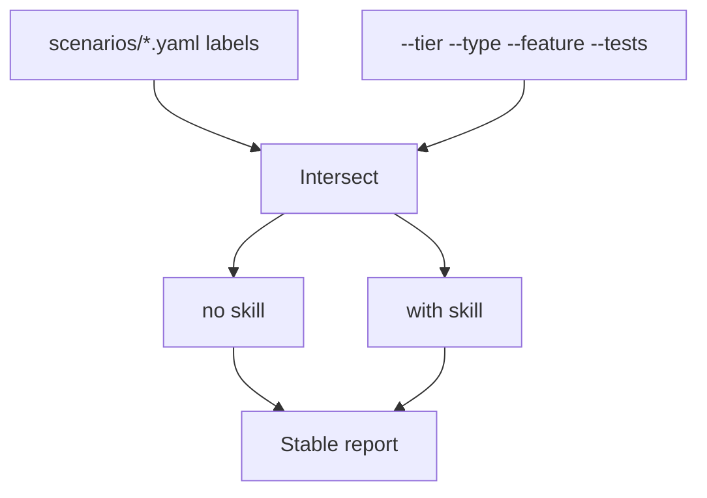

# Skill vs no-skill A/B testing infrastructure

Imperative plan to build continuous skill-vs-baseline comparison. Same voice as [implementation-plan.md](implementation-plan.md): decisions are settled; do not reopen them.

**This document plans infrastructure and docs.** Implementing it does **not** require executing a full `--compare` run or committing populated metrics. Operators run compares later.

Related: [testing.md](testing.md), [maintaining.md](maintaining.md), [CLAUDE.md](../CLAUDE.md), [README.md](../README.md).

## 1. Goal

Build harness support so skill usefulness is measured by pairing the **same** sandbox scenarios **with** the skill and **without** it.

Ship:

- Working `task test:compare` (and filters) fronting `test/run.sh`
- Labels on scenario YAML files (sole classification source)
- Stable workspace + `benchmark.json` generator + shape validation + diff helper
- Updates to `CLAUDE.md` and `README.md` for how/when to run A/B

**Measurement (settled):** for each selected scenario, report (1) oracle pass/fail delta and (2) metrics from `timing.json` / `grading.json` per arm, rolled up into `benchmark.json`: questions, turns, tokens, cost, duration. Pass/fail is primary; metrics explain cost/efficiency. Exact schemas: [align-tests-skill-creator.md](align-tests-skill-creator.md) §2.



## 2. Useful vs not useful for compare

**Useful for compare:** any scenario file with `compare: true`. Discover the set by reading `test/scenarios/*.yaml` or `task test:list`. **MUST NOT** maintain a living inventory table in docs (it drifts).

**Not useful for compare** (remain package/process gates; never selected by `--compare`):

- Grep genericity guard over `skills/hc-scaffold-service/`
- `SKILL.md` line-budget gate (`wc -l` ≤ 400)
- Stub `STUB_SCENARIO` modes as standalone tests
- Oracle unit checks on hand-made transcripts
- T8-style one-time baseline recording for rationalization authoring
- Implementation-plan T11–T15 process (prod verify, live run, docs refresh, Jira)
- Advisory LLM judge as the sole gate

Expected v1: all current files under `test/scenarios/` are `compare: true` (13 scenarios).

## 3. Labels live on the tests

**Required place:** `test/scenarios/*.yaml`. The harness reads labels at runtime.

Each compare scenario YAML **MUST** include:

```yaml
name: preflight-empty-catalog       # test id; MUST match filename basename (no .yaml)
description: Empty catalog fail-fast
compare: true                       # false/omit => excluded from A/B
tier: 1                             # 1 cheap/fail-fast … 3 complex
type: preflight                     # preflight | discipline | interview
feature: fail-fast                  # finer behavior label
stub_scenario: empty_catalog
prompt: Create a new service
# optional compare_prompt: "..."    # fair no-skill prompt if needed
expectations:
  - question_count: 0
```

| Field | Role |
|-------|------|
| `name` | Test id for `--tests`; equals file basename |
| `tier` | Cost/depth for `--tier` |
| `type` | Broad class for `--type` |
| `feature` | Behavior under test for `--feature` |
| `compare` | Opt-in to A/B suite |

### Vocabulary

- **`tier`:** `1` = fail-fast/cheap; `2` = medium discipline; `3` = complex interview/schema.
- **`type`:** `preflight` | `discipline` | `interview`.
- **`feature`:** `fail-fast` | `confirmation` | `template-discovery` | `schema-walk` | `no-resubmit` | `secrets-refusal` | `capability-matching` | `inference` | `question-budget` | `constraint-validation`.

### One-time label values (write into YAMLs once; do not copy into living docs)

When adding fields to existing scenarios, set:

- **Tier 1 / type `preflight` / feature `fail-fast`:** `preflight-no-capabilities`, `preflight-denied-call`, `preflight-empty-catalog`, `preflight-catalog-only`
- **Tier 2 / type `discipline`:** `nonexistent-template` (`template-discovery`), `secrets-template` (`secrets-refusal`), `task-failure` (`no-resubmit`), `prefixed-tool-names` (`capability-matching`), `time-pressure` (`confirmation`), `invalid-typed-value` (`constraint-validation`)
- **Tier 3 / type `interview`:** `plain-request` (`question-budget`), `under-specified-request` (`inference`), `conditional-template` (`schema-walk`), `synthetic-tenth` (`schema-walk`)

After that, inventory = the YAML files + `task test:list`.

### Fair prompts

Several scenarios currently start prompts with `/hc-scaffold-service`. That slash is not a real skill invoke when the skill is absent. For the no-skill arm the runner **MUST** use a fair prompt: strip a leading `/hc-scaffold-service` or use optional `compare_prompt` from the YAML. Same `stub_scenario` and `expectations` for both arms.

## 4. CLI

**Operator entry point is `task ...` only** — see [align-tests-skill-creator.md](align-tests-skill-creator.md) §1.3. `test/run.sh` is an implementation detail behind the Taskfile; do not document raw `run.sh` flags as the primary interface.

Filters **combine with AND** (intersection). Empty intersection → exit non-zero with a clear error listing the filters.

```bash
task test:compare
task test:compare:tier TIER=1
task test:compare:tier TIER=1,2
task test:compare:tests TESTS=preflight-empty-catalog,preflight-denied-call
task test:compare:type TYPE=preflight
task test:compare:feature FEATURE=fail-fast,confirmation
task test:compare TIER=2 TYPE=discipline
task test:list
```

| Task | Vars | Meaning |
|------|------|---------|
| `test:compare` | `TIER`, `TYPE`, `FEATURE`, `TESTS` (optional) | Pair no-skill then with-skill for the selection; write workspace + `benchmark.json` |
| `test:compare:tier1` | — | Cheap fail-fast compare (`TIER=1`) |
| `test:compare:tier` | `TIER` (required) | YAML `tier` ∈ set |
| `test:compare:type` | `TYPE` (required) | YAML `type` ∈ set |
| `test:compare:feature` | `FEATURE` (required) | YAML `feature` ∈ set |
| `test:compare:tests` | `TESTS` (required) | YAML `name` ∈ set (must be `compare: true`) |
| `test:list` | — | Print `name tier type feature` for `compare: true` scenarios; no runs |
| `test:scenario:no-skill` | `TESTS` (optional) | Single-arm baseline only (no pair, no compare report) |
| `MODEL`, `EFFORT` | forwarded vars | Applied to both arms when comparing |

`TESTS` accepts scenario file basenames without `.yaml`. Unknown `TESTS` / `TYPE` / `FEATURE` values → hard fail.

**After any change under `skills/hc-scaffold-service/`:**

- Minimum: `task test` (guards + `test:compare:tier1`)
- Before treating the change as done for merge/release: `task test:compare` (all compare scenarios)

**Measurement outputs (settled):** a paired run writes the workspace tree and `benchmark.json` defined in [align-tests-skill-creator.md](align-tests-skill-creator.md) §2.4 and §2.7 — `test/workspace/iteration-<N>/eval-<scenario>/{with_skill,without_skill}/{transcript.jsonl,outputs/,timing.json,grading.json}` plus a top-level `benchmark.json` with `run_summary` (pass rate / time / tokens, mean + delta) and `per_scenario` rows. `benchmark.json` metadata **MUST** record the effective `filters` and the exact sorted list of scenario `name`s executed so two runs with the same filters remain comparable. An optional `compare.md` may render the same data as a stable-column markdown table.

### Hybrid with skill-creator

The Task-driven compare above is the **primary**, automated runner. [align-tests-skill-creator.md](align-tests-skill-creator.md) also emits skill-creator-compatible `evals.json` / `triggers.json` under `skills/hc-scaffold-service/evals/` and adds prompt-printing tasks for the **secondary**, interactive skill-creator Claude Code plugin:

```bash
task test:skill-creator:install     # prints /plugin install + /reload-plugins hint
task test:skill-creator:eval        # prints the evaluate-with-evals.json prompt
task test:skill-creator:triggers    # prints the trigger-tuning prompt
```

Do not treat skill-creator as a replacement for `task test:compare`; it is for trigger/description tuning only.

## 5. What to build

### 5.1 Harness: no-skill arm

Today `test/run.sh` parses `--no-skill` but does **not** disable skill install in docker.

**MUST:**

1. Add `test/skills.none.test.yaml` (no local skill installed).
2. When `--no-skill` or `--without-skill`: set `SKILLS_TEMPLATE` to that file; do not enable `hc-scaffold-service`.
3. Accept `--without-skill` as an alias of `--no-skill`.
4. `task test:scenario:no-skill` fronts this arm.

### 5.2 Harness: compare mode + filters

**MUST:**

1. Add `compare`, `tier`, `type`, `feature` (and aligned `name`) on all compare scenario YAMLs.
2. Implement `--compare` on `test/run.sh` with `--tier` / `--type` / `--feature` / `--tests` AND semantics, fronted by `task test:compare[:tier|:type|:feature|:tests]`.
3. Implement `task test:list`.
4. For each selected scenario: run no-skill arm then with-skill arm (same model/effort), then generate the workspace + `benchmark.json` for the **selected** set only (canonical sort by `name`).
5. Package guards (grep / line budget): run once when the skill is present via `task test:guards`; skip on pure `--no-skill` runs; **not** part of the per-scenario A/B delta.
6. Each arm's `grading.json` / `timing.json` **MUST** capture: `skill_installed`, `name`, `tier`, `type`, `feature`, model (actual from transcript), effort, tokens, cost, duration, question/turn counts, pass/fail, assertion failures, skill git SHA — rolled up into `benchmark.json`.

### 5.3 Report generator + shape stability

Outputs when an operator runs `task test:compare` (not required during infra implementation):

- `test/workspace/iteration-<N>/benchmark.json` — machine-readable summary + per-scenario deltas
- `test/workspace/iteration-<N>/compare.md` — optional human summary rendered from the same data

Per scenario: both arms’ pass/fail + metrics + deltas (`improved` / `worsened` / `unchanged`).

Large transcripts stay gitignored. `benchmark.json` / `compare.md` may be committed when someone wants history.

#### Making successive reports comparable

Model runs are non-deterministic: two compares will **not** produce identical pass/fail or token numbers. Guarantees are **structural** and **input-control** only.

**Stable shape (same every run for a given filter set):**

1. `schema_version` on every `benchmark.json` (start at `1`; bump only when fields/sections change).
2. Fixed `compare.md` template, if generated — same headings and table columns every time. Missing values are `null` / `—`; never drop columns.
3. Canonical scenario order — alphabetical by `name` within the selection.
4. Fixed `per_scenario` fields (see [align-tests-skill-creator.md](align-tests-skill-creator.md) §2.7): `name`, `with_skill_pass`, `without_skill_pass`, `pass_delta`, `timing`, `grading_summaries`.
5. Metadata block first (same keys every time): `schema_version`, `skill_sha`, `model`, `effort`, `filters`, sorted `scenarios`.
6. Any generated `compare.md` uses the same keys as `benchmark.json`.

**Controlled variables:**

| Control | Rule |
|---------|------|
| Scenario set | Derived only from YAML labels + CLI filters; record exact set in metadata |
| Prompts | Fair-prompt function is pure/deterministic |
| Stub | `stub_scenario` from YAML; record fixture/repo SHA in metadata |
| Model / effort | Same on both arms; record actual model from transcript |
| Skill SHA | With-skill arm records SHA; no-skill records `skill_installed: false` |

**Validate on write:** `test/fixtures/compare-report.schema.json` (or a `benchmark.json`-specific schema). Fail `task test:compare` if the generated shape drifts. Do **not** assert metric equality.

**Diff helper:** `test/assertions/diff_compare.py` compares two `benchmark.json` files and surfaces schema mismatch, filter/scenario-set mismatch, model/effort mismatch, pass/fail flips, and advisory metric drift. Do not fail the build on metric noise by default. Fronted by `task test:diff`:

```bash
task test:diff A=test/workspace/iteration-1/benchmark.json B=test/workspace/iteration-2/benchmark.json
```

### 5.4 CLAUDE.md and README.md

**CLAUDE.md** — short section:

- After any change under `skills/hc-scaffold-service/`, run A/B before considering the change done
- Minimum: `task test` (guards + `test:compare:tier1`)
- Full: `task test:compare`
- Pointer to this document

**README.md** — contributor-facing:

- What A/B means (skill vs unaided model on the same scenarios)
- When to run (after skill changes; optional usefulness snapshot anytime)
- How: `task test:compare` examples including `TIER` / `TYPE` / `FEATURE` / `TESTS`
- Links to this document and [testing.md](testing.md)

Also add one-line cross-links from [testing.md](testing.md) and [maintaining.md](maintaining.md) to this document.

## 6. Out of scope

- Executing `task test:compare` or committing a populated metrics report as part of building the infra
- Changing skill content to chase scores
- Production live A/B
- Multi-model matrix (keep `MODEL` / `EFFORT` vars only)

## 7. Implementation order

Execute in order. Follow atomic commits (one logical deliverable per commit).

1. **This document is already the spec** — next commits implement harness/docs below (do not rewrite this file into an inventory table).
2. Label all scenario YAMLs (`compare`, `tier`, `type`, `feature`, aligned `name`). Commit: `test: add compare tier type feature labels to scenarios`
3. Add `test/skills.none.test.yaml`; fix `--no-skill` / `--without-skill` wiring; fair prompts. Commit: `test: honor --no-skill with skills.none template`
4. Implement `--compare`, filters, workspace + `benchmark.json` writer, schema fixture, `diff_compare.py`, fronted by `Taskfile.yml` tasks (see [align-tests-skill-creator.md](align-tests-skill-creator.md) §3). Commit(s): `test: add --compare with filters and stable reports` (split if large).
5. Update `CLAUDE.md`, `README.md`, [testing.md](testing.md), [maintaining.md](maintaining.md). Commit: `docs: document how and when to run skill vs baseline A/B`

## 8. Done when

- Scenario YAMLs carry labels; `task test:list` prints them
- `--no-skill` actually runs without the skill installed
- `task test:compare` with `TIER` / `TYPE` / `FEATURE` / `TESTS` selects the intersection and writes a schema-valid workspace + `benchmark.json`
- `CLAUDE.md` and `README.md` state how/when to run A/B
- No living scenario classification table exists in docs
